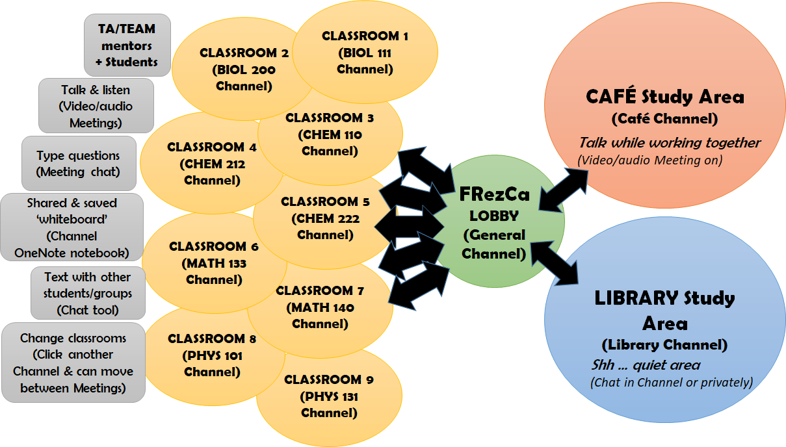

.. _channels:

Channel Details
--------------------
- **General:** Important announcements or posts may be linked here, students cannot chat in this channel.
- **Course channels:**
    * TAs and TEAM mentors will host meetings at set hours (see :ref:`Schedule`).
    * Students can join these meetings (audio/video optional) to ask questions to TA/TEAM, discuss with each other, meet other students and work together on homework and assignments. Chat function (replying to threads) is turned on.
    * Students cannot start their own meetings or question threads in course channels.
- **Virtual cafe:** Casual virtual space, not led by TAs or TEAM mentors (but still moderated by FRezCa admin), open always.
    * Students can start their own message threads, start meetings (audio/video optional), reply to each other and chat in meetings.
    * Students may choose to group up by course or year if desired, depending on other students' current availability.

<!--* At certain set hours (see :ref:`Schedule`), FRezCa staff will start meetings for students to join. However, the virtual space remains open outside of these hours if students would like to set up other times to work collaboratively in the Cafe.
- **Virtual library:** Casual quiet virtual space, not led by TAs or TEAM mentors (but still moderated by FRezCa admin), open always.
* Students can start their own message threads and chat by replying to threads or starting other conversations in the channel.
* Students SHOULD NOT use the voice and video functions if they choose to start a meeting to maintain a quiet zone for independent studying in a virtual shared space.
* At certain set hours (see :ref:`Schedule`), FRezCa staff will start meetings for students to join. However, the virtual space remains open outside of these hours if students would like to set up other times to work silently in the Library.--!>

**Within each channel, users can:**

- Join meetings (with audio for up to 250 participants, video for up to 9 participants)
- Share screen within a meeting (permissions open for students and TAs/TEAM/staff)
- Use chat function in meeting or reply to thread in comments to communicate by text
- Use raise hand feature to signal desire to ask a question out loud
- Write collaboratively on the Course OneNote (listed in the topbar tabs) to make notes, use as a whiteboard, draw, write, etc.

**Bubble digram summarizing the structure of online FRezCa**

