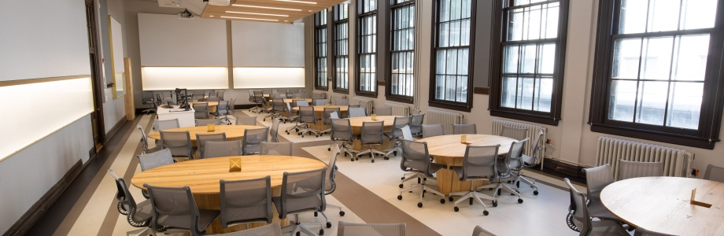

.. _live:

Live FRezCa
===========

In addition to the main Virtual FRezCa platform on MS Teams, starting the week of Monday, October 5 (tentative for now due to COVID-19), Live FRezCa will be open. Live FRezCa for Fall 2020 is an in-person space on campus for students who would like a quiet place to work and access FRezCa.

**As with all on-campus activities at McGill this term, masks will be mandatory at Live FRezCa.**

**Where:** Arts 150 – maximum capacity of 22 students per day due to COVID-19 distancing guidelines. Please sign up in advance on `MS Bookings <https://outlook.office365.com/owa/calendar/InPersonFRezCaFall2020@McGill.onmicrosoft.com/bookings/s/N5bBnguJcEqKSOFNs6Zyhw2>`__ at least 24 hours before the session.

**When:** 3:05pm-4:55pm on Mon/Tue/Wed/Fri; 5:05pm-6:55pm on Thu

**What:** A space with socially-distanced tables to work independently, or chat quietly with other students and staff present at a distance of at least 2m apart. Academic support (by teaching staff, TAs, or TEAM) will not be provided in-person at Live FRezCa – however, students are encouraged to access the MS Teams Virtual FRezCa platform while in the Live FRezCa space!

Note: Although the times for Live FRezCa may not necessarily overlap with scheduled course FRezCa sessions, the Virtual Library and Café channels remain open for students at all times.

**Who:** Up to 22 students/day + 1 FRezCa staff member.

**Why:** While we know that not all students are currently based in Montreal, we recognize that some may want or need an on-campus space for quiet studying with big tables, natural light, and a good internet connection. This location was selected for all of the above and will exclusively be open to early-year students enrolled in courses using FRezCa. You can work independently, or feel free to discuss the undergraduate experience together, ask general questions about your faculty or department, or just come to chat with a real person face-to-face!
