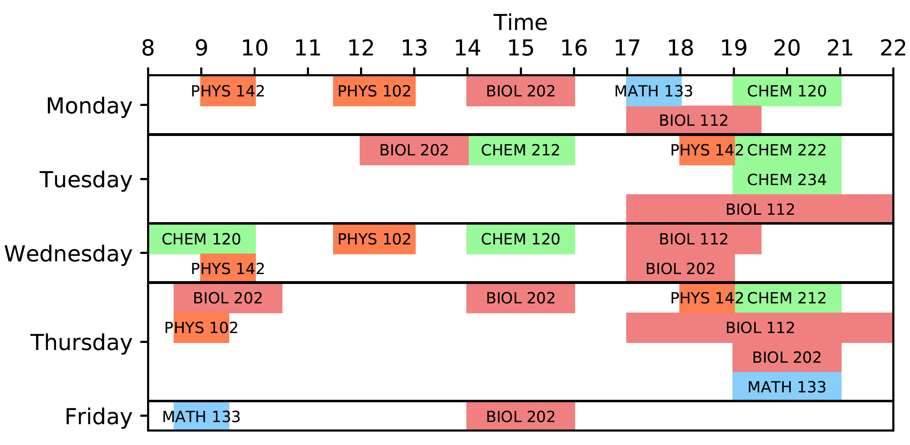

.. _Schedule:

FRezCa Schedule
===============

**Virtual Café is also open at all times (unstaffed) if students would like to communicate on their own.**

Courses
=======

Participating courses include:

- **Fall:** BIO 111/200, CHEM 110/212/222, MATH 133/140/141, PHYS 101/131
- **Winter:** BIO 112/202, CHEM 120/212/222/234, MATH 133/140/141, PHYS 102/142, MIMM 214
