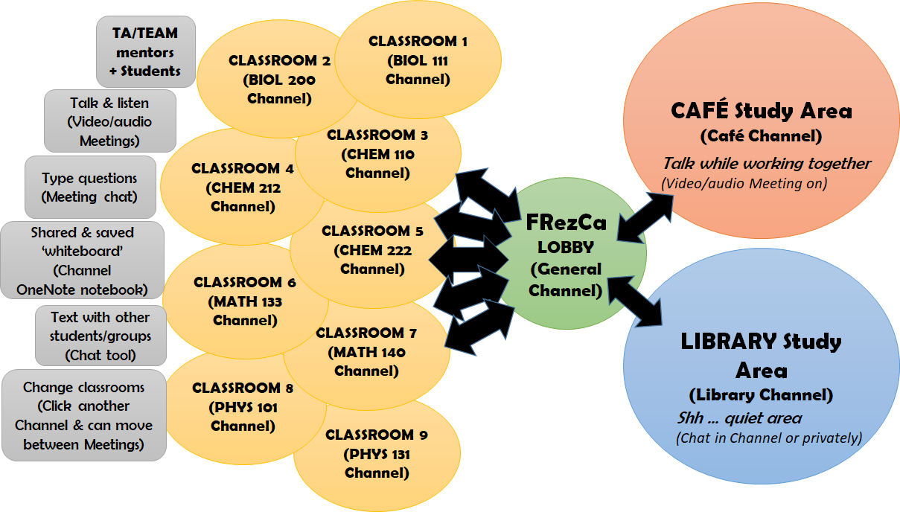

======
FRezCa
======
What is FRezCa?
---------------

FRezCa (Freshman Residence Cafeteria) tutorials is a space for U0/U1 students in large science classes to:

- Work together
- Study in shared space
- Learn from each other
- Complete homework or assignments collaboratively
- Ask for help from other students, undergraduate TEAM mentors or graduate TAs

FRezCa was previously held in the Royal Victoria College residence cafeteria but this semester (Fall 2020) will be a fully online virtual platform held on MS Teams! All students enrolled in BIOL 111, BIOL 200, CHEM 110, CHEM 212, CHEM 222, MATH 133, MATH 140, MATH 141, PHYS 101 and PHYS 131 are welcome to participate.

Getting started
---------------

.. raw:: html

     <iframe width="560" height="315" src="https://www.youtube.com/embed/xZk9bVRPU9c" frameborder="0" allow="accelerometer; autoplay; encrypted-media; gyroscope; picture-in-picture" allowfullscreen></iframe>

In your FRezCa myCourses, you will find information on how to join the Microsoft FRezCa Teams.
If you are not in FRezCa myCourses, you should contact your course instructor and he/she will be able to invite you!

Channels in MS Teams
--------------------
- **General:** Important announcements or posts may be linked here, students cannot chat in this channel.
- **Course channels:**
    * TAs and TEAM mentors will host meetings at set hours (see :ref:`Schedule`).
    * Students can join these meetings (audio/video optional) to ask questions to TA/TEAM, discuss with each other, meet other students and work together on homework and assignments. Chat function (replying to threads) is turned on.
    * Students cannot start their own meetings or question threads in course channels.
- **Virtual cafe:** Casual virtual space, not led by TAs or TEAM mentors (but still moderated by FRezCa admin), open always.
    * Students can start their own message threads, start meetings (audio/video optional), reply to each other and chat in meetings.
    * Students may choose to group up by course or year if desired, depending on other students' current availability.
    * At certain set hours (see :ref:`Schedule`), FRezCa staff will start meetings for students to join. However, the virtual space remains open outside of these hours if students would like to set up other times to work collaboratively in the Cafe.
- **Virtual library:** Casual quiet virtual space, not led by TAs or TEAM mentors (but still moderated by FRezCa admin), open always.
    * Students can start their own message threads and chat by replying to threads or starting other conversations in the channel.
    * Students SHOULD NOT use the voice and video functions if they choose to start a meeting to maintain a quiet zone for independent studying in a virtual shared space.
    * At certain set hours (see :ref:`Schedule`), FRezCa staff will start meetings for students to join. However, the virtual space remains open outside of these hours if students would like to set up other times to work silently in the Library.

**Within each channel, users can:**

- Join meetings (with audio for up to 250 participants, video for up to 9 participants)
- Share screen within a meeting (permissions open for students and TAs/TEAM/staff)
- Use chat function in meeting or reply to thread in comments to communicate by text
- Use raise hand feature to signal desire to ask a question out loud
- Write collaboratively on the Course OneNote (listed in the topbar tabs) to make notes, use as a whiteboard, draw, write, etc.

**Bubble digram summarizing the structure of online FRezCa**

FRezCa Schedule
---------------

"Library" and "Cafe" events posted on the schedule are open to all U0 and U1 students enrolled in FRezCa courses. U0 and U1 Formal FRezCa sessions will be staffed by TA's, undergraduate student mentors, and occasionally even the course professors.

.. list-table:: Fall 2020 Virtual FRezCa Sessions
   :align: center
   :widths: 7 25 35 25
   :header-rows: 1

   * - Day
     - 8am - 10am
     - 2pm - 4pm
     - 7pm - 9pm
   * - Mon
     - | Math 133/139
       | Math 140/141
     - | Math 133/139
       | Math 140/141
     - | Biol 111
       | Math 133/139
       | Math 140/141
       | Phys 101/131
   * - Tue
     -
     - Phys 101/131 (2:30-4:30pm)
     - | Biol 200
       | Chem 212/222
   * - Wed
     - | Biol 111
       | Math 133/139
       | Math 140/141
       | Phys 101/131
     - | Chem 110
       | Math 133/139
       | Math 140/141
     - | Chem 110
       | Math 133/139
       | Math 140/141
   * - Thu
     - | Math 133/139
       | Math 140/141
     - | Biol 111
       | Chem 100
       | Math 133/139
       | Math 140/141
     - | Biol 111
       | Math 133/139
       | Math 140/141
   * - Fri
     -
     - | Biol 200
       | Chem 110/212
     -

**Café and Library are also open at all times (unstaffed) if students would like to communicate on their own.**

Code of Conduct
---------------
Please also read :ref:`code` :)

Resources
---------------
If you'd like to learn more on Microsoft Teams, click on :ref:`resource` !

Contact us!
-----------
Questions or feedback? Please contact frezca.science@mcgill.ca

Guides
^^^^^^
.. toctree::
   :maxdepth: 2

   History
   Live
   Code
   Schedule
   Resources
   Contacts
