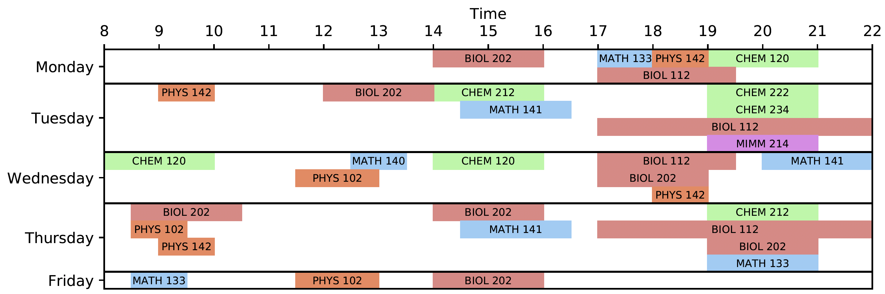

======
FRezCa
======
What is FRezCa?
---------------

FRezCa (Freshman Residence Cafeteria) tutorials is a space for U0/U1 students in large science classes to:

- Work together
- Study in shared space
- Learn from each other
- Complete homework or assignments collaboratively
- Ask for help from other students, undergraduate TEAM mentors or graduate TAs

FRezCa was previously held in the Royal Victoria College residence cafeteria, but since COVID-19, a fully online virtual platform is held on Microsoft Teams!

If the pandemic allows, a :ref:`live` will also be available in parallel to the online version for those who wishes to have some face-to-face interactions!

Getting started
---------------

.. raw:: html

     <iframe width="560" height="315" src="https://www.youtube.com/embed/xZk9bVRPU9c" frameborder="0" allow="accelerometer; autoplay; encrypted-media; gyroscope; picture-in-picture" allowfullscreen></iframe>

(Note that Virtual Library was taken out, but feel free to use the Virtual Cafe!)

In your FRezCa myCourses, you will find information on how to join the Microsoft FRezCa Teams. If you are not in FRezCa myCourses, you should contact your course instructor and he/she will be able to invite you!

You can find our channel details here: :ref:`channels`.

Schedule
--------

**Virtual Café is also open at all times (unstaffed) if students would like to communicate on their own.**

Courses
-------

Participating courses include:

- **Fall:** BIO 111/200, CHEM 110/212/222, MATH 133/140/141, PHYS 101/131
- **Winter:** BIO 112/202, CHEM 120/212/222/234, MATH 133/140/141, PHYS 102/142, MIMM 214

Code of Conduct
---------------
Please also read :ref:`code` :)

Resources
---------------
If you'd like to learn more on Microsoft Teams, click on :ref:`resource` !

Contact us!
-----------
Questions or feedback? Please contact frezca.science@mcgill.ca

Guides
^^^^^^
.. toctree::
   :maxdepth: 2

   History
   Schedule
   Channels
   Live
   Code
   Resources
   Contacts
